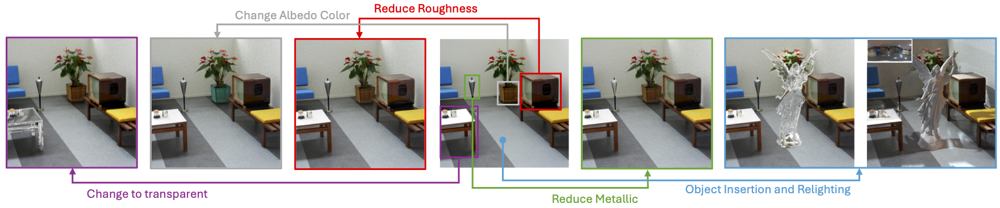

# Materialist
# [Project Page](https://lez-s.github.io/materialist.github.io/) | [Paper](https://arxiv.org/abs/2501.03717)

Materialist is an inverse rendering framework for material estimation and editing from single images. It leverages differentiable rendering techniques to accurately recover physically-based materials and lighting conditions from photographs.

# Features

- Single-image inverse rendering
- Material decomposition into albedo, roughness and metallic maps
- Environment map estimation
- Material editing capabilities
- Specialized rendering for transparent and translucent materials


# Usage

## 1. Installation andExternal Dependencies

- Mitsuba
- PyTorch 

### Requirements

Materialist requires Python 3.10 and CUDA-compatible GPU hardware. Install dependencies with:

```bash
pip install -r requirements.txt
```


## 2. Inverse Rendering Pipeline

To reconstruct materials from a single image:

```bash
# Run the inverse rendering pipeline with default settings
./run_inverse_pipeline.sh
```

You can specify which example to process by entering the corresponding number when prompted.


## 3. Command Line Arguments

### 3.1 Inverse Rendering
- `--img_inverse_path`: Path to the input image
- `--save_name`: Name for saving results
- `--opt_order`: Optimization order for material parameters (e.g., "rm a" for roughness+metallic then albedo)
- `--use_mask`: Use mask during optimization, this is used for material editing purposes
- `--opt_env_from`: start environment map optimization from this iteration.

#### 3.1.1 Settings for Synthetic images
```
python inverse_img_w_mi.py --model_name=pos_mlp --opt_src=arm --opt_env_from=0 --opt_order=arm
```
#### 3.1.2 Settings for real world images
⚠️ For real images, the following settings are recommended:
```
python inverse_img_w_mi.py --model_name=pos_mlp --opt_src=a --opt_env_from=2 --opt_order=rm a
``` 

if above settings do not yield good results, try optimize without using network, this will take longer time but usually yield better results:
```
python inverse_img_w_mi.py --model_name=none --opt_src=a --opt_env_from=2 --opt_order=rm a
```


### 3.2 Rendering and Editing
```bash
# Render with default settings
python render_final.py --save_name="indoor" --mode="real"

# Render with transparency
python trans_edit.py --save_name="indoor" 
```

- `--env_path`: Path to environment map (HDR)
- `--save_name`: Name of saved results
- `--mode`: Rendering mode ("real" for rendering without changes or "oi" for object insertion)
- `--input_path`: Custom path for material loading
- `--save_path`: Custom path for saving rendered images

# 4. Output

Results are saved to the `output_imgs/{save_name}/` directory, including:
- Material maps (albedo, roughness, metallic)
- Environment maps
- Rendered images (PNG and HDR/EXR formats)
- Reconstructed mesh (.ply)

# Citation
```
@article{wang2025materialist,
    title={Materialist: Physically Based Editing Using Single-Image Inverse Rendering},
    author={Wang, Lezhong and Tran, Duc Minh and Cui, Ruiqi and TG, Thomson and Chandraker, Manmohan and Frisvad, Jeppe Revall},
    journal={arXiv preprint arXiv:2501.03717},
    year={2025}
    }
```

# Acknowledgements
This project is built upon the work of many contributors. We acknowledge the use or modify of the following libraries and works: [FIPT](https://github.com/lwwu2/fipt), [SAM2](https://github.com/facebookresearch/sam2), [DepthAnything](https://github.com/DepthAnything/Depth-Anything-V2), [Mitsuba](https://mitsuba-renderer.org/). Specifically, for depth estimation, we adopted the weights from [DepthAnything](https://github.com/DepthAnything/Depth-Anything-V2) to better adapt to real world image inverse rendering.
We also acknowledge the use of the [Blender](https://www.blender.org/) and [BlenderProc](https://github.com/DLR-RM/BlenderProc) for physical simulation purposes. 